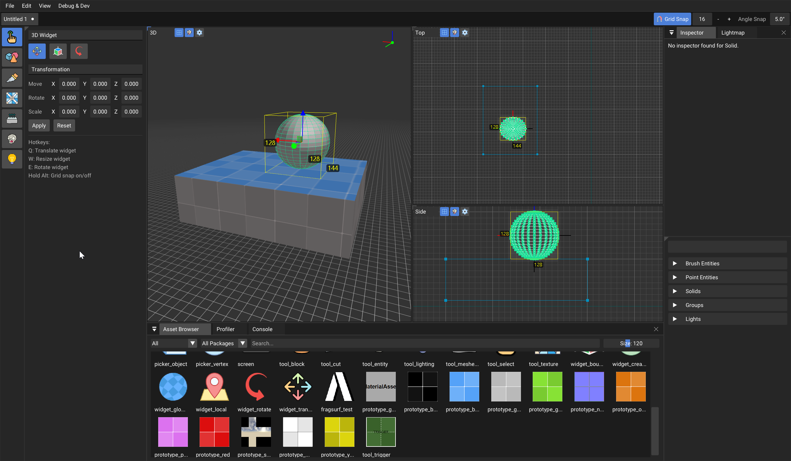

## What is this?

Graybox is a modern hammer-like level editor built for [Fragsurf](https://store.steampowered.com/app/1033410/Fragsurf/) & [AIRACCEL](https://github.com/fragsurf/airaccel).

Additionally, it is a minimal game engine built mostly for testing and internal purposes.  Graybox.Bunnyhop is a game project with example usage.

The format is simple and easy; you can use it for your game, too.  But more work must be done to make it simple and easy for you.  For example, there is no documentation or way of describing your game's entities, currently, it's a static file created for Fragsurf, i.e. `Graybox.Bunnyhop/Assets/Entities/Deathmatch.json`

## What else?

Bunnyhop and surf have thrived for a very long time thanks to the passion of its community.  We want to continue that, and give creators the tools they need to build awesome maps.

## Roadmap

The roadmap will be posted later.

## Early Development

Graybox is a fork of CBRE-EX, a fork of CBRE, a fork of Sledge.  It's been rewritten from the ground up, and it's very early in development. Many things will change, and many things aren't as good as they could be.

## Screenshots

